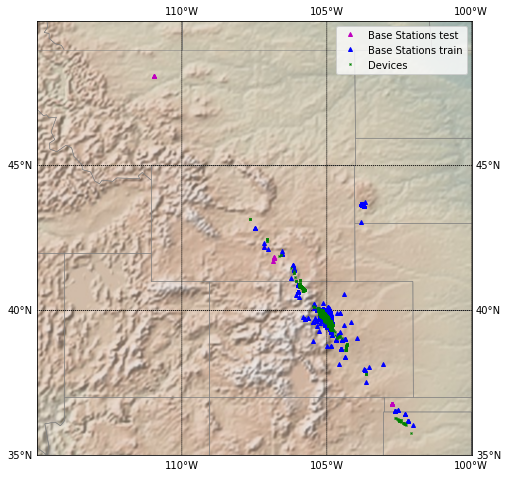

# IoT trackers geolocation 

The notebook of this folder presents a solution to geolocate IOT asset trackers thanks to a Machine Learning algorithm.

The notebook has been redacted in french but you can find the corresponding english article in my portfolio here : https://antonindurieux.github.io/portfolio/2_IOT_geolocation/, under a beautiful presentation and with some small improvements.

This project was a group work done during my Post Master program in Big Data at Télécom-Paris.

## Usage

The code and explanation is in the [IoT_Geolocalisation.ipynb](https://github.com/antonindurieux/IoT-trackers-geolocation/blob/master/IoT_Geolocalisation.ipynb) notebook.

The raw data are in the [data](https://github.com/antonindurieux/IoT-trackers-geolocation/tree/master/data) folder.

The resulting infered geolocations are in the [output](https://github.com/antonindurieux/IoT-trackers-geolocation/tree/master/output) folder.

## Data

The data has been provided by [Sigfox](https://www.sigfox.com/en).
It consisted of messages sent by IOT asset trackers and received by the Sigfox base stations network in the USA.

Here is an extract :

|    | messid                   |   bsid |    did |   nseq |   rssi |     time_ux |   bs_lat |   bs_lng |
|---:|:-------------------------|-------:|-------:|-------:|-------:|------------:|---------:|---------:|
|  0 | 573bf1d9864fce1a9af8c5c9 |   2841 | 473335 |    0.5 | -121.5 | 1.46355e+12 |  39.6178 | -104.955 |
|  1 | 573bf1d9864fce1a9af8c5c9 |   3526 | 473335 |    2   | -125   | 1.46355e+12 |  39.6773 | -104.953 |
|  2 | 573bf3533e952e19126b256a |   2605 | 473335 |    1   | -134   | 1.46355e+12 |  39.6127 | -105.009 |
|  3 | 573c0cd0f0fe6e735a699b93 |   2610 | 473953 |    2   | -132   | 1.46355e+12 |  39.798  | -105.073 |
|  4 | 573c0cd0f0fe6e735a699b93 |   3574 | 473953 |    1   | -120   | 1.46355e+12 |  39.7232 | -104.956 |

The information contained in each messages are the following:
- **messid** is the message id;
- **bsid** is the reception base station id;
- **did** is the device (tracker) id;
- **nseq** is a variable whose meaning was not provided, maybe it could be usefull, maybe not...
- **rssi** is the [received signal strength](https://fr.wikipedia.org/wiki/Received_Signal_Strength_Indication){:target="_blank"};
- **time_ux** is the reception time;
- **bs_lat** and **bs_lng** are the coordinates of the reception base station.

## Content

- Data import
- Positionning of the dataset
- Computation of the feature matrix
- Leave-one-device-out cross-validation and modeling
- Inference